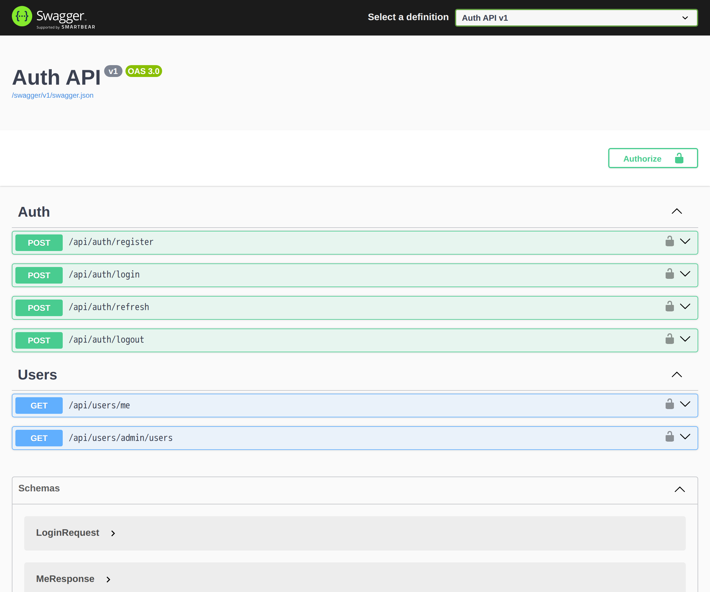

# Auth API

A clean, secure authentication & authorization REST API — a reusable building block for any
project. Email/password registration with hashing, JWT access tokens plus rotating refresh
tokens (with revoke and reuse/theft detection), and role-based authorization. Self-documenting
via Swagger and shipped as a single-command Docker stack with automated tests.




## Features

- **Register / login** with BCrypt password hashing.
- **JWT access tokens** (short-lived) + **refresh tokens** (long-lived, stored only as a hash).
- **Refresh-token rotation** — every refresh issues a new pair and revokes the old token;
  presenting an already-revoked token revokes the whole chain (theft response).
- **Role-based authorization** (`Admin` / `User`) with a protected admin-only endpoint.
- **Swagger UI** with a Bearer "Authorize" button so you can try protected endpoints.
- Seeded admin account and roles on first run.

## Tech stack

| Layer | Technology |
|-------|------------|
| API | ASP.NET Core (.NET 10) |
| Data | EF Core + PostgreSQL (Npgsql) |
| Auth | JWT bearer (HS256), BCrypt |
| Tests | xUnit (unit + integration via WebApplicationFactory) |
| Infra | Docker Compose |

## Quick start

> Prerequisites: **Docker and git only.**

```bash
git clone https://github.com/peemphetpimolzzz/auth-api.git
cd auth-api
cp .env.example .env
docker compose up --build
```

- Swagger UI — <http://localhost:8082/swagger>
- Health — <http://localhost:8082/health>

A seeded admin account is created: `admin@demo.dev` / `Admin123!` (change for production).

## Auth flow (curl)

```bash
API=http://localhost:8082

# Register a normal user (returns access + refresh tokens)
curl -s -X POST $API/api/auth/register -H 'Content-Type: application/json' \
  -d '{"email":"user@demo.dev","password":"P@ssw0rd123"}'

# Login
TOKENS=$(curl -s -X POST $API/api/auth/login -H 'Content-Type: application/json' \
  -d '{"email":"user@demo.dev","password":"P@ssw0rd123"}')
ACCESS=$(echo "$TOKENS" | sed -n 's/.*"accessToken":"\([^"]*\)".*/\1/p')

# Call a protected endpoint
curl -s $API/api/users/me -H "Authorization: Bearer $ACCESS"

# Admin-only endpoint → 403 for a normal user
curl -s -o /dev/null -w "%{http_code}\n" $API/api/users/admin/users -H "Authorization: Bearer $ACCESS"

# Log in as the seeded admin → 200 on the same endpoint
```

## Running the tests

```bash
# Unit tests (token service + password hasher)
docker run --rm -v "$PWD:/src" -w /src mcr.microsoft.com/dotnet/sdk:10.0 \
  dotnet test backend/tests/AuthApi.UnitTests/AuthApi.UnitTests.csproj

# Integration tests (real API against a throwaway PostgreSQL)
docker compose -f docker-compose.yml -f docker-compose.test.yml run --rm integration-tests
```

Both run on every push via GitHub Actions.

## Security notes

- The dev JWT key in `.env.example` is **dev-only** — generate a strong key for production.
- HS256 signing key must be ≥ 32 bytes; the app refuses to start otherwise.
- Refresh tokens are stored only as SHA-256 hashes; rotation + reuse detection limit token theft.
- Passwords are hashed with BCrypt (salted, adaptive work factor).

## Configuration

Copy `.env.example` to `.env`: PostgreSQL credentials, `JWT_KEY/JWT_ISSUER/JWT_AUDIENCE`, and
host ports (`DB_PORT` defaults to `15432` to avoid clashing with a local PostgreSQL).

## License

[MIT](LICENSE)
